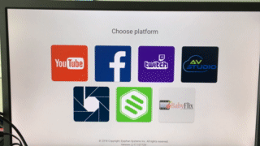

# Introduction

Welcome to the AV Studio API! You can use our API to pair, control and monitor Epiphan devices.

We have language bindings in bash and Python. You can view code examples in the dark area to the right, and you can switch the programming language of the examples with the tabs in the top right.

# Big picture

Each encoder device has a long poll connection to AV Studio and waits for commands. Initially, all devices are *unpaired*, which means that they are not assiciated with any AV Studio account. To pair a device, log in to your AV Studio account and send a pairing command to AV Studio using the pairing code. AV Studio finds the device that has this code and connects your account to it.

# Authentication

```python
from avstudio import AVStudioAPI

api = AVStudioAPI("go.avstudio.com")
api.login(USERNAME, PASSWORD)
```

```shell
curl -v https://go.avstudio.com/front/api/v1t/oauth/base/USERNAME?pwd=PASSWORD
```

To login to your AV Studio account, use this code:

```
> GET /front/api/v1t/oauth/base/USERNAME?pwd=PASSWORD HTTP/2
> Host: go.avstudio.com
> User-Agent: curl/7.54.0
> Accept: */*
>
< HTTP/2 302
< server: nginx/1.11.3
< date: Fri, 12 Oct 2018 17:43:42 GMT
< content-type: text/html; charset=utf-8
< content-length: 91
< location: https://go.avstudio.com/TEAMID#/scenes
< set-cookie: KSESSIONID=KSESSIONID; Path=/; Expires=Sat, 12 Oct 2019 17:43:42 GMT; Max-Age=31536000
< x-current-team-id: TEAMID
< strict-transport-security: max-age=15724800; preload
```

The successful response has team and session identifiers, which are used in subsequent requests in this session.

# Getting All Devices

There're two devices in a newly created AV Studio account, let's retrieve them:

```python
devices = api.Devices.get_all()
for d in devices:
    print d["Id"], d["Name"]

# Output:
# demo_0_d3d68f3c-cd3e-4ee6-ab25-4646973c6277 My First Demo Device
# demo_1_4e0a964a-b350-435f-82c9-de6ab5188af2 My Second Demo Device
```

```shell
curl https://go.avstudio.com/front/api/v1t/team/TEAMID/devices \
  -H "Cookie: KSESSIONID=KSESSIONID"
```

> The above command returns array with the device info dictionaries:

```json
[
  {
    "Id": "demo_0_d3d68f3c-cd3e-4ee6-ab25-4646973c6277",
    "Name": "My First Demo Device",
    "Model": "Demo",
    "Status": "Online",
    "Recording": "unknown",
    "StateTime": 1539366714.931,
    "SnapshotURL": "/front/api/v1/devices/demo_0_d3d68f3c-cd3e-4ee6-ab25-4646973c6277/state.jpg",
    "IsUnpaired": false,
    "Telemetry": {}
  }
]
```

`GET /front/api/v1t/team/TEAMID/devices`

Parameter | Description
--------- | -----------
TEAMID | Team ID from auth response

# Getting a Specific Device

```python
device = api.Devices.get("demo_0_d3d68f3c-cd3e-4ee6-ab25-4646973c6277")
```

```shell
curl https://go.avstudio.com/front/api/v1t/team/6ef82053-5bb5-4ba6-9e43-e8565a827b9c/devices/demo_0_d3d68f3c-cd3e-4ee6-ab25-4646973c6277 \
  -H "Cookie: KSESSIONID=SESSIONID"
```

> Result:

```json
[
  {
    "Id": "demo_0_d3d68f3c-cd3e-4ee6-ab25-4646973c6277",
    "Name": "My First Demo Device",
    "Model": "Demo",
    "Status": "Online",
    "Recording": "unknown",
    "StateTime": 1539366714.931,
    "SnapshotURL": "/front/api/v1/devices/demo_0_d3d68f3c-cd3e-4ee6-ab25-4646973c6277/state.jpg",
    "IsUnpaired": false,
    "Telemetry": {}
  }
]
```

`GET /front/api/v1t/team/TEAMID/devices/DEVICEID`

Parameter | Description
--------- | -----------
TEAMID | Team ID from the auth response
DEVICEID | The ID of the device to retrieve

# Pairing a Real Device

Let's pair a real device.

### Switching the Webcaster X2 Device to AV Studio Mode

There are two ways to switch modes:

Double press the power button on the device until the LCD screen shows Epiphan logo:


Or select AV Studio using a monitor and attached USB mouse:



### Pairing the Device

To pair a device we use the following endpoint:

`POST /front/api/v1t/team/TEAMID/devices`


```python
r = api.Devices.add("5cf06c29", "NEW DEVICE")
device_id = r["ID"]
```

```shell
curl -X POST https://go.avstudio.com/front/api/v1t/team/TEAMID/devices \
  -H "Cookie: KSESSIONID=SESSIONID" \
  -d '{"DeviceID": "5cf06c29", "Name": "NEW DEVICE"}'
```

> Result:

```json
{
    "Status": "ok",
    "StatusCode": 200,
    "ID": "DEVICEID"
}
```

# Device Commands

## Sending Commands to Devices

> e.g. setting bitrate to 1 Mbit/s:

```python
api.Devices.run_command(deviceId, "setparam:bitrate=1000")
```

```shell
curl https://go.avstudio.com/front/api/v1t/team/TEAMID/devices/DEVICEID/task \
 -H "Cookie: KSESSIONID=SESSIONID" \
 --data-binary '{"cmd": "setparam:bitrate=1000"}'
```

To send commands to devices, POST `{"cmd": COMMAND}` json to this endpoint:

`POST front/api/v1t/team/TEAMID/devices/DEVICEID/task`

## setparam:

```python
api.Devices.get(deviceId)["Telemetry"]["settings"].keys()

# Output: ['resolution', 'bitrate']
```

```shell
curl https://go.avstudio.com/front/api/v1t/team/TEAMID/devices/DEVICEID \
-H "Cookie: KSESSIONID=SESSIONID" \
| jq '.Telemetry.settings | keys'

# Output:
# [
#   "bitrate",
#   "resolution"
# ]
```

This command sets the value of the device settings parameter. Available parameters are listed in the device info Telemetry/settings dictionary.

Epiphan Webcaster X2's support the following parameters:

Param|Possible values|Description
-----|---------------|-----------
resolution|1920x1080, 1280x720, 640x360, 320x180|Stream frame size
bitrate|up to 4000|Stream bitrate, in Kbit/s

## rtmp.start:url

```python
api.Devices.run_command(deviceId, "rtmp.start:rtmp://10.1.2.16/live/test")
```

```shell
 curl https://go.avstudio.com/front/api/v1t/team/TEAMID/devices/DEVICEID/task \
 -H "Cookie: KSESSIONID=SESSIONID" \
 --data-binary '{"cmd": "rtmp.start:rtmp://10.1.2.16/live/test"}'
```

> The status of the RTMP stream is reported in `Telemetry/state/rtmp`.
> 
> `speed` is actual_uploading_speed/bitrate ratio, values greater or equal to 1.0 are ok, less than 1.0 means there's not enough bandwidth.

```json
"rtmp": {
    "url": "rtmp://10.1.2.16/live/test", 
    "speed": 1.00,
    "bitrate": 2061,
    "sent": {
        "frames": 896, 
        "bytes": 7723008
    }
}
```

This command starts an RTMP stream to a given RTMP url.

## rtmp.stop

```python
api.Devices.run_command(deviceId, "rtmp.stop")
```

```shell
 curl https://go.avstudio.com/front/api/v1t/team/TEAMID/devices/DEVICEID/task \
 -H "Cookie: KSESSIONID=SESSIONID" \
 --data-binary '{"cmd": "rtmp.stop"}'
```

To stop the RTMP stream that was started by `rtmp.start`

## firmware.update

```python
api.Devices.run_command(deviceId, "firmware.update")
```

```shell
 curl https://go.avstudio.com/front/api/v1t/team/TEAMID/devices/DEVICEID/task \
 -H "Cookie: KSESSIONID=SESSIONID" \
 --data-binary '{"cmd": "firmware.update"}'
```

Starts a firmware update if a more recent firmware version is available.

## unpair

```python
api.Devices.run_command(deviceId, "unpair")
```

```shell
 curl https://go.avstudio.com/front/api/v1t/team/TEAMID/devices/DEVICEID/task \
 -H "Cookie: KSESSIONID=SESSIONID" \
 --data-binary '{"cmd": "unpair"}'
```

Unpairs the device from the account that it's paired to.
